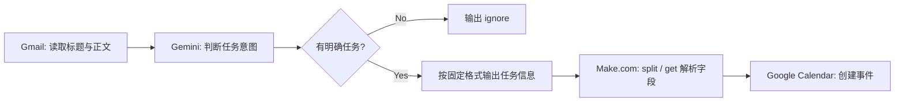

# 智能邮件日程助手 Agent / Smart Email Schedule Agent

一个基于 Make.com、Gmail、Google Gemini AI 与 Google Calendar 的 AI 工作流原型，用于识别邮件中的有效任务、会议或截止日期，并在信息足够明确时自动创建日历事件。

An AI workflow prototype built with Make.com, Gmail, Google Gemini AI, and Google Calendar. It identifies actionable tasks, meetings, and deadlines from email content, then creates calendar events only when the information is explicit enough.

**Make 公开场景 / Public Make Scenario:**  
https://us2.make.com/public/shared-scenario/dBzIyQyj3ld/integration-gmail-google-gemini-ai-goo

**作品集主页 / Portfolio:**  
https://xueyangfeng1108-xyf.github.io/

## 项目定位 / Project Positioning

这是一个 AI 工作流产品原型案例，展示如何把生成式 AI 放进真实业务流程中：读取邮件、判断是否包含可执行事项、约束输出格式、解析结果，并在风险可控的前提下执行日历创建。

This is an AI workflow product prototype that demonstrates how generative AI can be embedded into a practical workflow: reading emails, judging whether an actionable schedule item exists, constraining output, parsing the response, and executing calendar creation within clear safety boundaries.

## 用户问题 / User Problem

用户经常通过邮件接收会议、截止日期、提醒和临时待办。这些信息分散在不同邮件里，格式不统一，需要人工阅读、判断、复制时间并创建日历事件，流程重复且容易遗漏。

Users often receive meetings, deadlines, reminders, and tasks through email. These items are scattered across messages and appear in inconsistent formats. Manually reading, judging, extracting dates and times, and creating calendar events is repetitive and error-prone.

## 原人工流程 / Current Manual Journey

1. 打开邮件并阅读完整上下文。
2. 判断邮件是否真的包含需要行动的事项。
3. 提取标题、日期、时间和详情。
4. 切换到 Google Calendar。
5. 手动创建事件并核对信息。

1. Open the email and read the full context.
2. Decide whether the message contains an actionable item.
3. Extract title, date, time, and details.
4. Switch to Google Calendar.
5. Manually create and verify the event.

## 产品目标 / Product Goal

- 判断邮件是否包含明确任务、会议、提醒或截止日期。
- 当没有任务时，直接输出 `ignore`，不进入日历创建。
- 当存在任务时，按固定格式输出优先级、任务名、开始时间、结束时间和详情。
- 通过 Make.com 将模型结果映射到 Google Calendar。
- 避免在信息不完整时自动执行高影响动作。

- Identify whether an email contains a clear task, meeting, reminder, or deadline.
- Output `ignore` when no actionable task exists.
- When a task exists, return priority, task name, start time, end time, and details in a fixed format.
- Map the AI output into Google Calendar through Make.com.
- Avoid high-impact automation when key information is incomplete.

## 工作流 / Workflow

## 输出规则 / Output Contract

中文：  
这个 Agent 的输出被设计成两个分支：无明确任务时输出 `ignore`；有明确任务时输出可被 Make.com 解析的固定字段。这个设计减少了后续模块的处理成本，也避免模型生成多余描述影响自动化执行。

English:  
The Agent output is designed as two branches: return `ignore` when no clear task exists, or return fixed fields that Make.com can parse when a valid task exists. This reduces downstream processing complexity and prevents extra model-generated text from breaking the automation flow.

## 工具与集成 / Tools & Integration

| 模块 / Layer | 工具 / Tool | 作用 / Role |
|---|---|---|
| 输入 / Input | Gmail | 读取邮件标题与正文。 |
| AI 判断 / AI Reasoning | Google Gemini AI | 判断邮件是否包含任务，并输出 ignore 或固定格式任务。 |
| 自动化编排 / Orchestration | Make.com | 串联 Gmail、Gemini 与 Calendar，并使用函数解析模型输出。 |
| 执行动作 / Action | Google Calendar | 为有效事项创建日历事件。 |
| 风险控制 / Safety | Output rule + ignore logic | 避免无任务或信息不足时误创建事件。 |

## 验证结果 / Result & Evidence

在 10 封测试邮件中：

- 4 封被识别为有效日程或任务事项。
- 4 个 Google Calendar 事件被成功创建。
- 无任务或信息不足的邮件通过 `ignore` 规则被过滤。

In a small test with 10 emails:

- 4 emails were identified as valid schedule-related items.
- 4 Google Calendar events were created successfully.
- Non-actionable or incomplete emails were filtered through the `ignore` rule.

## 应用价值 / Product Value

- 减少手动阅读、复制和创建日历的重复操作。
- 把隐藏在邮件正文里的承诺、截止日期和会议提醒转成可见日程。
- 形成可复用的 Agent 模式：Trigger → Classify → Extract → Act。

- Reduces repetitive manual reading, copying, and calendar creation.
- Turns commitments, deadlines, and meeting reminders hidden in emails into visible calendar events.
- Demonstrates a reusable Agent pattern: Trigger → Classify → Extract → Act.

## 风险边界 / Responsible AI Boundaries

- 不公开 Gmail 内容、Google 连接、Gemini API Key、Make 凭据或 Telegram token。
- 不让 AI 在缺少日期、时间或任务对象时自动创建事件。
- 对模糊表达，例如“下周五下午”，下一步应加入人工确认。

- Do not expose Gmail content, Google connections, Gemini API keys, Make credentials, or Telegram tokens.
- Do not allow the AI to create events when date, time, or task details are missing.
- Ambiguous expressions such as "next Friday afternoon" should trigger human confirmation in future iterations.

## 下一步优化 / Next Iteration

- 创建日历前增加人工确认节点。
- 增加高、中、低置信度标签。
- 记录 ignore 原因、创建失败原因和异常日志。
- 支持 Slack、Notion、Todoist 或 Outlook 等更多工作流入口。
- 建立简单运营看板，追踪处理邮件数、有效事项数、忽略原因和失败原因。

- Add a human confirmation step before creating events.
- Add confidence labels: high, medium, and low.
- Log ignore reasons, failed creation attempts, and exceptions.
- Extend the workflow to Slack, Notion, Todoist, or Outlook.
- Build a simple dashboard to track processed emails, valid tasks, ignore reasons, and failure causes.
